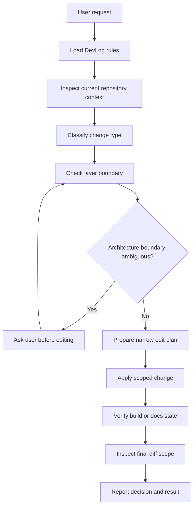
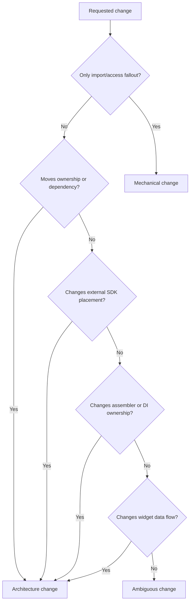
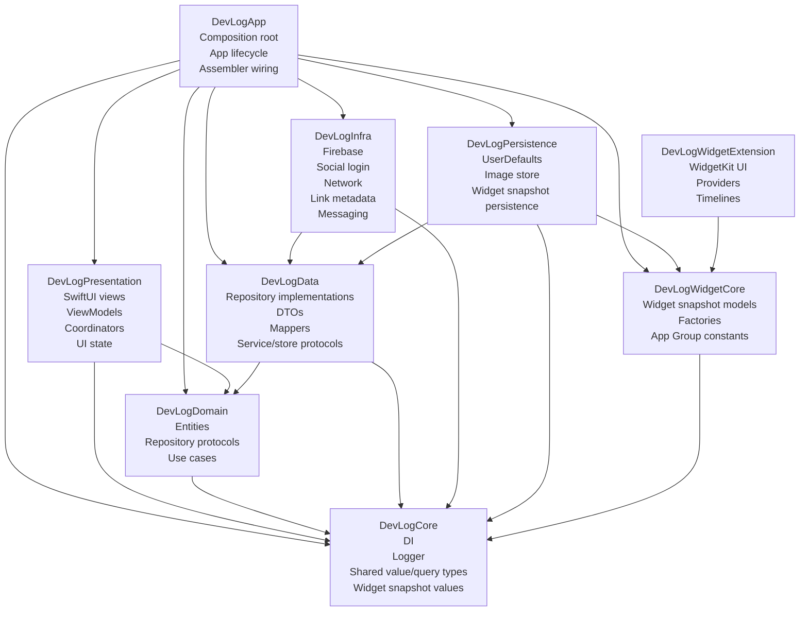
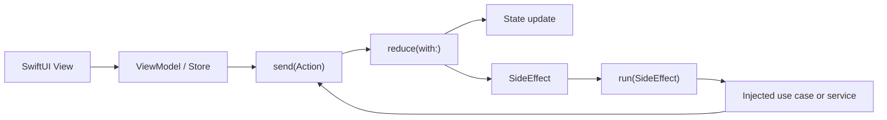
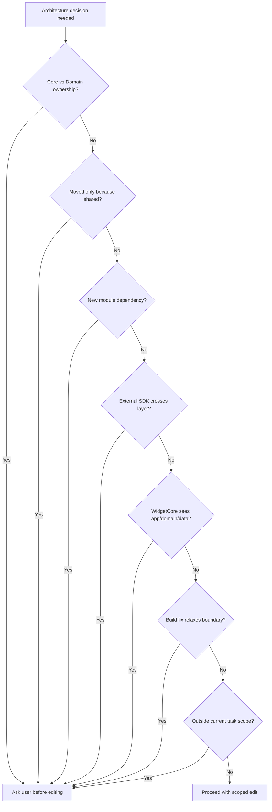
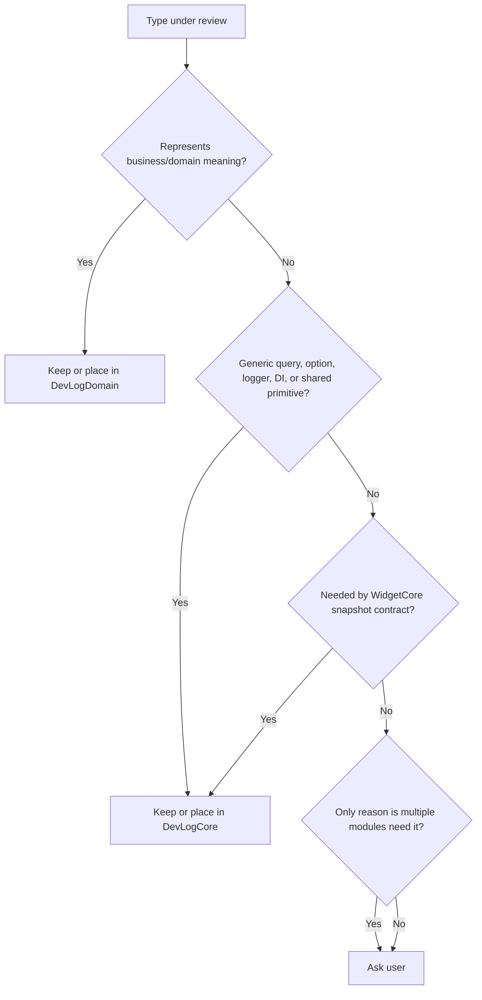
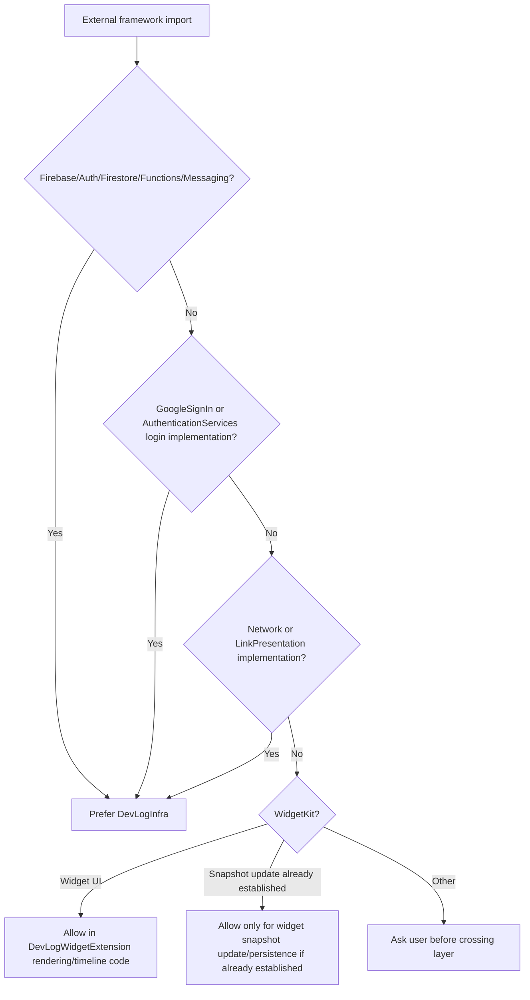
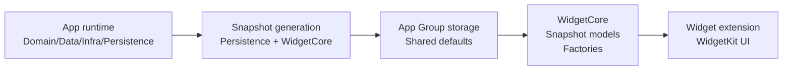
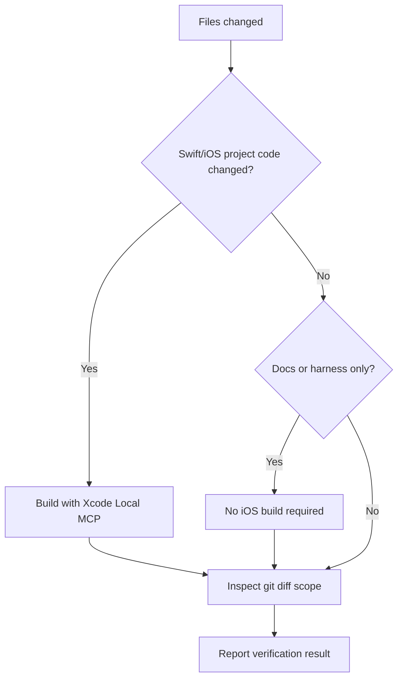

# DevLog Architecture Flow

## Purpose

This reference defines the DevLog-specific harness flow for AI-assisted architecture work.

The goal is not to make the AI decide more architecture policy. The goal is to make the AI stop before it makes project-specific architecture decisions that should be confirmed by the user.

Use this reference with `AGENTS.md` and `.hermes/skills/devlog-architecture-harness/SKILL.md`.

This repository is an Xcode workspace-based modular iOS app. There is no root `Package.swift`; modules are separate `.xcodeproj` entries under `DevLog.xcworkspace`.

## High-level harness flow

## Change classification

## DevLog layer map

## Boundary rules

| Layer | Owns | Allowed direction | Ask before |
| --- | --- | --- | --- |
| `DevLogCore` | DI primitives, logger, shared value/query types, widget snapshot values | No DevLog layer dependency | Moving domain entities into Core |
| `DevLogDomain` | entities, repository protocols, use cases | Core only | Adding Data, Infra, Persistence, Presentation, App, Widget UI, or SDK dependency |
| `DevLogData` | repository implementations, DTOs, mappers, data protocols | Domain, Core | Adding concrete Firebase, WidgetKit, storage, or platform implementation details |
| `DevLogInfra` | Firebase, social login, network, metadata, messaging implementations | Data, Core | Moving SDK-specific behavior out of Infra |
| `DevLogPersistence` | local stores, image cache, widget snapshot persistence | Data, Core, WidgetCore | Moving domain logic or remote SDK behavior into Persistence |
| `DevLogPresentation` | UI, view models, coordinators, presentation state | Domain, Core | Adding Data, Infra, Persistence, or App dependency |
| `DevLogApp` | composition root, lifecycle, assembler wiring | Concrete app layers | Moving feature logic into App |
| `DevLogWidgetCore` | widget data contracts and pure snapshot logic | Core | Adding Domain, Data, Infra, Persistence, Presentation, or App dependency |
| `DevLogWidgetExtension` | WidgetKit rendering and timeline plumbing | WidgetCore | Calling app/domain services directly |

## Presentation Store flow

Preserve this flow unless the user explicitly asks to change the Presentation architecture. Reducers compute state and return side effects. I/O belongs in `run` or injected services.

## Ambiguity gate

The AI must stop and ask the user when it reaches any of these points.

## Core vs Domain decision flow

Use this flow when deciding whether a type belongs in Core or Domain.

## External dependency flow

Use this flow before introducing or moving imports such as Firebase, GoogleSignIn, AuthenticationServices, UserNotifications, LinkPresentation, Network, or WidgetKit.

## Widget data-flow boundary

Widget UI should consume snapshot data. It should not fetch app services or domain repositories directly.

## Verification flow

## Required working notes

Before editing architecture code, the AI should be able to answer these questions:

1. What layer owns the changed concept today?
2. What layer should own it after the change?
3. Which imports prove the current dependency direction?
4. Which target dependency will change?
5. Does the change expose an external SDK outside its current boundary?
6. Does the change affect WidgetCore or WidgetExtension boundaries?
7. Is this change inside the current issue or PR scope?
8. Is user confirmation required before editing?

## Completion checklist

- DevLog-specific rules were loaded.
- Current files and imports were inspected.
- Ambiguous architecture decisions were confirmed by the user.
- Swift logic was preserved unless explicitly approved.
- Diff scope was checked.
- Xcode Local MCP build was used for Swift/iOS code changes.
- Docs-only or harness-only changes were reported as such, without claiming app build verification.
