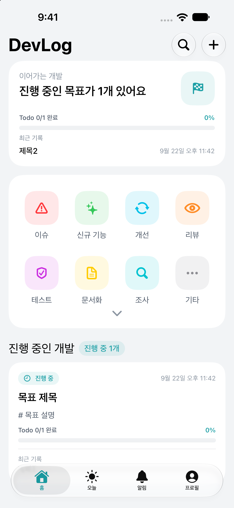
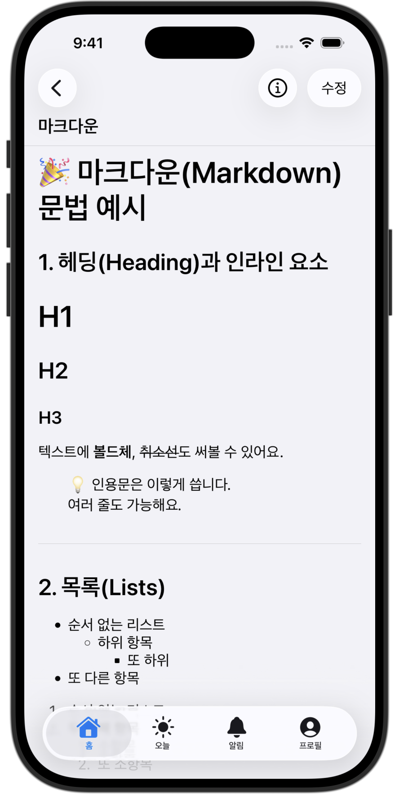
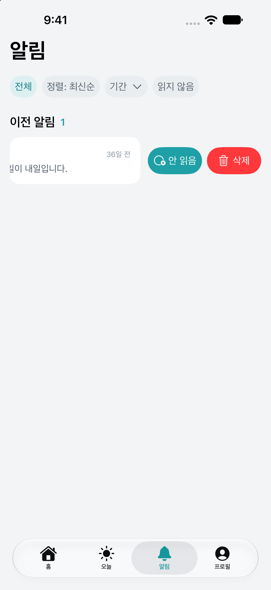
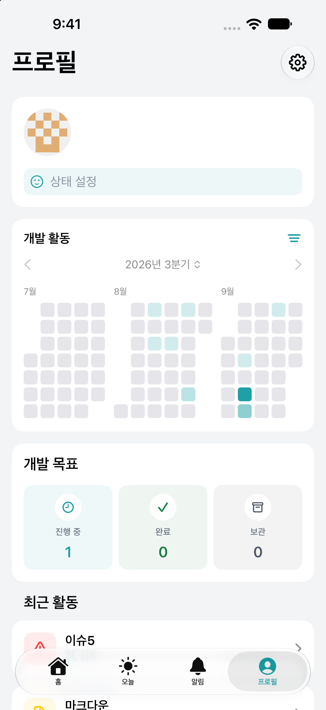
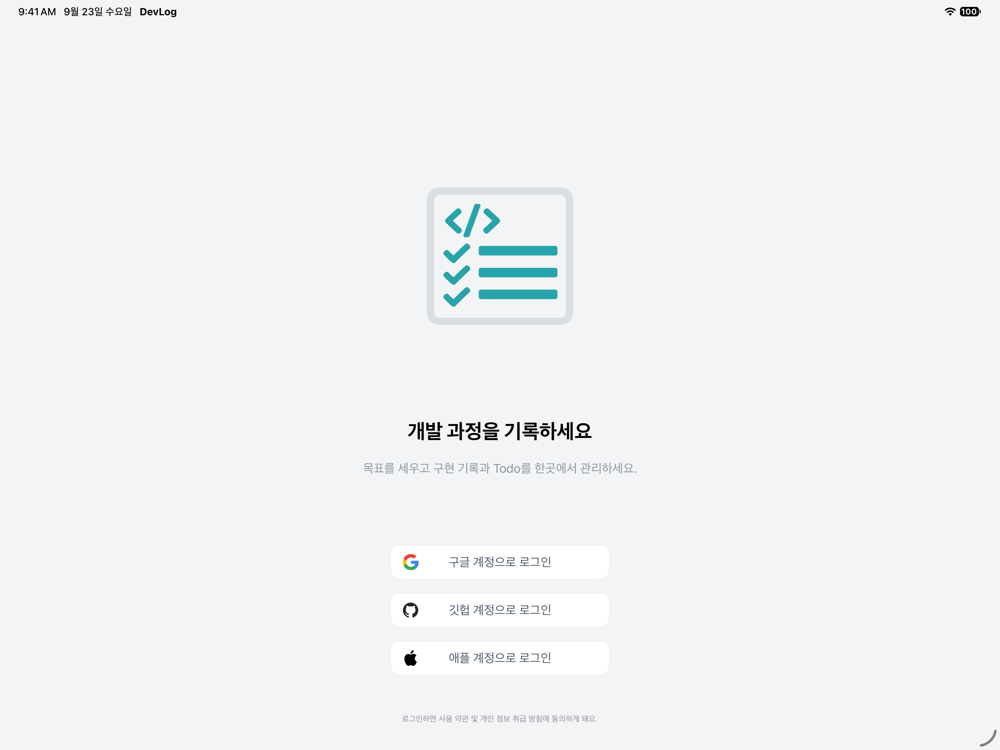
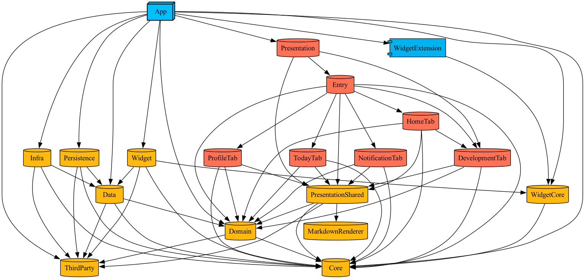

# DevLog

> 개발 기록과 Todo를 한 곳에서 관리하는 SwiftUI 기반 앱  
> 작업 메모, 마감 일정, 개인 활동 흐름을 하나의 앱 안에서 정리하는 구조

<table>
  <tr>
    <td align="center" width="25%">
      
    </td>
    <td align="center" width="25%">
      
    </td>
    <td align="center" width="25%">
      
    </td>
    <td align="center" width="25%">
      
    </td>
  </tr>
  <tr>
    <td align="center">홈</td>
    <td align="center">마크다운 작성</td>
    <td align="center">푸시 알림</td>
    <td align="center">히트맵</td>
  </tr>
</table>

<table>
  <tr>
    <td align="center">
      
    </td>
  </tr>
  <tr>
    <td align="center">iPad 로그인</td>
  </tr>
</table>

## 앱 사용해보기

<a href="https://apps.apple.com/us/app/devlog/id6760288611">
  
</a>

## 프로젝트 개요

개발 중 해야 할 일과 진행 기록이 여러 곳에 흩어지는 문제를 해결하기 위해 Todo, 개발 목표와 기록, 오늘 할 일, 받은 알림, 누적 활동을 하나의 앱에서 관리하도록 구성한 앱

## 아키텍처

- `DevLog.xcworkspace` 안에서 Application, Libraries, Widget 모듈을 분리하고 화면, 상태, 비즈니스 로직, 외부 의존성 경계를 나눈 `Clean Architecture` 기반 구성
- `Domain`을 중심으로 계층별 책임과 의존 방향을 분리해 비즈니스 규칙이 UI, 데이터 저장소, 외부 SDK 구현에 의존하지 않도록 구성
- `ThirdParty` target은 Swift Package 선언과 product 링크만 소유하는 계층 외부 registry이며 필요한 target이 선택적으로 의존함
- `Presentation` target은 `App`의 기존 import를 유지하는 re-export 역할
	- `Entry`: root/auth/tab shell/window 흐름 소유
	- `PresentationShared`: 공통 Todo/Search/Loading 흐름 소유
	- `DevelopmentTab`: 개발 목표 탭과 개발 목표, 개발 기록 화면 소유
	- `HomeTab`, `TodayTab`, `NotificationTab`, `ProfileTab`: 탭 단위 흐름 소유
- `MarkdownRenderer` target은 SwiftUI 공개 화면과 참조 값, 내부 `WKWebView` 연결, HTML/JavaScript/CSS 자원과 TypeScript Tooling을 소유함
- `PresentationShared`에서는 `TodoMarkdownContentView`만 `MarkdownRenderer`를 직접 import하며 재노출하지 않음

<table>
  <tr>
    <td align="center">
      
    </td>
  </tr>
  <tr>
    <td align="center">Tuist 모듈 의존성 그래프 (테스트 대상과 외부 패키지 대상 제외)</td>
  </tr>
</table>

## 주요 기능

| 화면 | 기능 |
| --- | --- |
| 로그인과 계정 관리 | Google, GitHub, Apple 로그인<br>계정 연동과 해제, 로그아웃, 회원 탈퇴 |
| Home | Todo 유형별 진입점과 노출 여부 및 순서 편집<br>진행 중인 개발 목표의 Todo 진행률과 최근 개발 기록 요약 |
| Todo | 8개 유형별 목록, 정렬, 완료 상태와 중요 표시 필터, 목록 내 검색과 페이지네이션<br>스와이프로 중요 표시, 완료, 삭제<br>Markdown, 태그, 마감일, 중요 표시 기반 작성과 수정 |
| 개발 목표와 기록 | 개발 목표 생성과 상태 전환, 연결한 Todo의 진행률<br>개발 기록 작성과 확정, 버전 이력과 되돌리기 |
| Today | 오늘 마감 Todo의 완료 개수와 진행률 카드<br>지난 마감, 오늘, 7일 내, 나중, 일정 미정으로 분류 |
| 알림 | 푸시 알림 목록의 정렬, 기간, 읽지 않음 필터<br>알림 선택 시 Todo 상세 확인과 읽음 처리<br>실시간 동기화와 페이지네이션, 다음 날 마감 Todo 리마인드 푸시 |
| 검색 | Todo 통합 검색과 디바운스 처리<br>최근 검색어 저장, 개별 삭제, 전체 삭제 |
| 프로필과 설정 | 상태 메시지 수정, 최근 수정 Todo, 분기별 활동 히트맵<br>테마 변경, 푸시 알림 시간 설정 |
| 위젯 | 오늘 할 일과 활동 히트맵 |

## 핵심 성과

### **1. 위젯 갱신용 Todo 전체 조회를 로그인 세션 복구와 날짜 변경 때만 수행하도록 제한**
> **문제**<br>
> 위젯 동기화 트리거가 백그라운드 전환 하나로 단일화된 뒤 Todo 변경, 위젯 표시 설정 변경, 로그인 세션 복구에서도 전체 조회를 요청하도록 확장됨<br>
> 전체 조회는 Today와 Heatmap 쿼리를 마지막 페이지까지 읽어 한 번에 여러 쿼리가 발생함<br>
> 같은 날짜의 백그라운드 전환, Todo 변경, 설정 변경마다 앱이 이미 아는 변경에도 전체 조회가 반복될 수 있음
>
> **해결**<br>
> 전체 조회 요청을 로그인 세션 첫 진입과 날짜가 바뀐 뒤 첫 백그라운드 전환으로 한정하고 같은 날짜는 날짜 가드로 조회 없이 넘김<br>
> Today와 Heatmap 원본을 스냅샷을 만드는 객체의 프로세스 수명 메모리에 두고 Todo 변경은 해당 항목만 갱신<br>
> 설정 변경은 조회 없이 저장된 원본으로 스냅샷만 재생성
>
> **성과**<br>
> • 전체 조회를 데이터 갱신이 필요한 시점에만 수행하고 같은 날짜의 백그라운드 전환에서는 생략<br>
> • Todo 변경과 설정 변경은 서버 조회 없이 메모리 원본으로 위젯 스냅샷에 반영

```swift
guard !Calendar.current.isDate(syncDate, inSameDayAs: now) else { return }

guard hasRequestedWidgetSync == false else { return }
hasRequestedWidgetSync = true
widgetSyncEventBus.publish(.syncRequested)
```

### **2. Set 기반 선형 병합으로 알림 목록의 로컬 숨김 상태 병합 시간 단축**
> **문제**<br>
> 푸시 알림은 삭제 후 Undo가 가능한 동안 로컬에서만 숨김 상태로 유지함<br>
> 숨김 상태는 서버 데이터에 없어 실시간 스냅샷으로 목록을 교체하면 사라질 수 있으므로 새 알림마다 로컬 목록을 앞에서부터 탐색해 다시 적용함<br>
> 새 알림 N건과 로컬 알림 M건에서 평균 O(N×M)이라 알림이 많을수록 병합 시간이 빠르게 늘어남
>
> **해결**<br>
> 반복 탐색의 기준이 알림 전체가 아니라 숨김 처리된 알림의 id라는 점에 주목<br>
> 숨김 알림의 id만 `Set`으로 구성하고 새 알림은 `contains`로 확인해 포함된 알림에만 숨김 상태를 다시 적용
>
> **성과**<br>
> • 10,000건 기준 병합 처리 시간 평균 7638.301ms → 5.326ms ([측정 기록](https://github.com/opficdev/DevLog_iOS/wiki/%ED%91%B8%EC%8B%9C-%EC%95%8C%EB%A6%BC-%EB%A6%AC%EC%8A%A4%ED%8A%B8-%EB%8D%B0%EC%9D%B4%ED%84%B0-%EC%B5%9C%EC%8B%A0%ED%99%94-%EA%B0%9C%EC%84%A0%ED%95%98%EA%B8%B0), 시뮬레이터 10회 평균)<br>
> • 평균 시간복잡도 O(N×M) → O(N+M)

```swift
let hiddenNotificationIds = Set(currentNotifications.filter(\.isHidden).map(\.id))

return incomingNotifications.map { notification in
    guard hiddenNotificationIds.contains(notification.id) else {
        return notification
    }
    ...
}
```

### **3. 단방향 흐름만 제어하던 자체 Store 프로토콜을 SwiftUI에 맞춘 구조의 TCA로 전환**
> **전환 배경**<br>
> 자체 Store는 Action이 State를 바꾸는 단방향 흐름만 제어했고 SwiftUI와의 연결은 View가 직접 맡았음<br>
> Binding은 View마다 `Binding(get:set:)`으로 구성하고 시트와 얼럿은 표시 여부 Bool 상태를 따로 두었음<br>
> 비동기 작업은 `run`에서 Task를 바로 띄우고 구독은 ViewModel마다 직접 보관하고 해제해 겹친 요청의 취소와 교체를 개별 구현에 맡겼음
>
> **전환 과정**<br>
> SwiftUI의 상태 기반 Binding과 시트, 얼럿 표시에 맞춰진 구조이면서 비동기 작업의 수명을 취소 ID로 선언할 수 있는지를 기준으로 TCA를 선택<br>
> Binding은 `BindingAction`으로, 시트와 얼럿은 표시 여부 Bool 대신 Optional 상태와 `AlertState`로 옮겨 View가 Feature 상태에서 파생된 값으로 표시<br>
> 겹칠 수 있는 조회와 구독은 Effect에 취소 ID와 `cancelInFlight`를 선언해 이전 요청을 Feature가 취소<br>
> 화면 단위 PR로 나눠 전환하고 마지막 PR에서 자체 Store를 제거
>
> **결과**<br>
> • Binding, 시트와 얼럿 상태의 구성 위치가 View에서 Feature로 이동하고 겹칠 수 있는 요청의 취소는 Feature에서 선언<br>
> • Action과 Effect의 결과를 `TestStore`로 Feature 단위에서 검증 가능

```swift
@ObservableState
struct State: Equatable {
    @Presents var alert: AlertState<Never>?
    @Presents var sheet: SheetState?
    ...
}

.cancellable(id: CancelID.fetchNotificationsAndObserve, cancelInFlight: true)
```

---

## 기술 스택

| 구분 | 스택 |
| --- | --- |
| Deployment Target | iOS / iPadOS 18.0+ |
| Platform Support | iPhone, iPad, Apple Silicon Mac (App Store, Designed for iPad) |
| Architecture | Tuist Modular based Clean Architecture |
| UI | SwiftUI, WidgetKit, AppIntents |
| State & Async | Observable, Combine, async/await, The Composable Architecture |
| Backend | Firebase Authentication, Firestore, Cloud Messaging, Cloud Functions, Firebase Hosting, Cloud Run (NestJS API, Staging) |
| Monitoring | Firebase Analytics, Crashlytics |
| Apple Frameworks | AuthenticationServices, UserNotifications, Network, CryptoKit, os.log |
| External Packages | Firebase iOS SDK, GoogleSignIn, ComposableArchitecture, xctest-dynamic-overlay, Swift Collections, Nexa, Cradle, UIComposable |
| Testing | swift-testing, TCA TestStore |
| Tooling | Xcode, Tuist, mise, Swift Package Manager, SwiftLint, Fastlane |


## 개발 환경 구성

- Xcode 프로젝트와 워크스페이스는 Tuist manifest를 기준으로 생성하며 Git은 생성물을 추적하지 않음
- `.mise.toml`에서 Tuist 버전을 고정
- `Workspace.swift`, 각 모듈의 `Project.swift`, `Tuist/ProjectDescriptionHelpers`가 Xcode 프로젝트 생성 기준
- Swift Package 의존성은 Tuist 생성 과정에서 `.spm/` 아래로 resolve

### 환경 버전

| 항목 | 버전 |
| --- | --- |
| Xcode | 27.0 |
| iOS Deployment Target | 18.0 |
| Swift | 5.0 |
| Tuist | 4.194.4 |
| SwiftLint | 0.63.3 |
| Ruby | 3.4.7 |
| Bundler | 2.7.2 |
| Fastlane | 2.232.2 |

### 1. 도구 설치

```bash
brew install mise
brew install swiftlint
mise install
```

### 2. 비공개 설정 파일 준비

앱 실행에 필요한 비공개 설정 파일은 리포지토리에 포함되지 않음

```text
Application/App/Sources/Resource/
├── Config.xcconfig
└── GoogleService-Info.plist
```

Firebase 프로젝트와 Firestore database는 build configuration 기준으로 분리함

```text
Debug, Staging -> staging Firebase project / Firestore (default)
Release -> prod Firebase project / Firestore (default)
```

- TestFlight archive는 `Staging`, App Store 실제 서비스 archive는 `Release` configuration을 사용
- GitHub Actions 배포 workflow는 PR label 기반 자동 실행 없이 수동 실행
- TestFlight build는 App Store 심사 제출 대상으로 승격하지 않고, 실제 배포는 같은 `MARKETING_VERSION`의 별도 `Release` configuration build로 생성
- build number는 TestFlight와 App Store upload가 공유하는 App Store Connect build number 공간에서 자동 증가

- TestFlight build: `bundle exec fastlane testflight_build_only`
- TestFlight upload: `bundle exec fastlane deploy_testflight`
- App Store build: `bundle exec fastlane appstore_build_only`
- App Store upload: `bundle exec fastlane deploy_appstore`

### 3. Xcode 워크스페이스 생성

```bash
mise exec -- tuist generate --no-open
```

### 4. 빌드 확인

- Xcode에서 `DevLog.xcworkspace` 열기
- `App` 스킴 선택
- iOS Simulator 선택 후 Build 실행

`Project.swift`, `Workspace.swift`, `Tuist/ProjectDescriptionHelpers`를 수정한 경우 다시 워크스페이스 생성 명령 실행.

